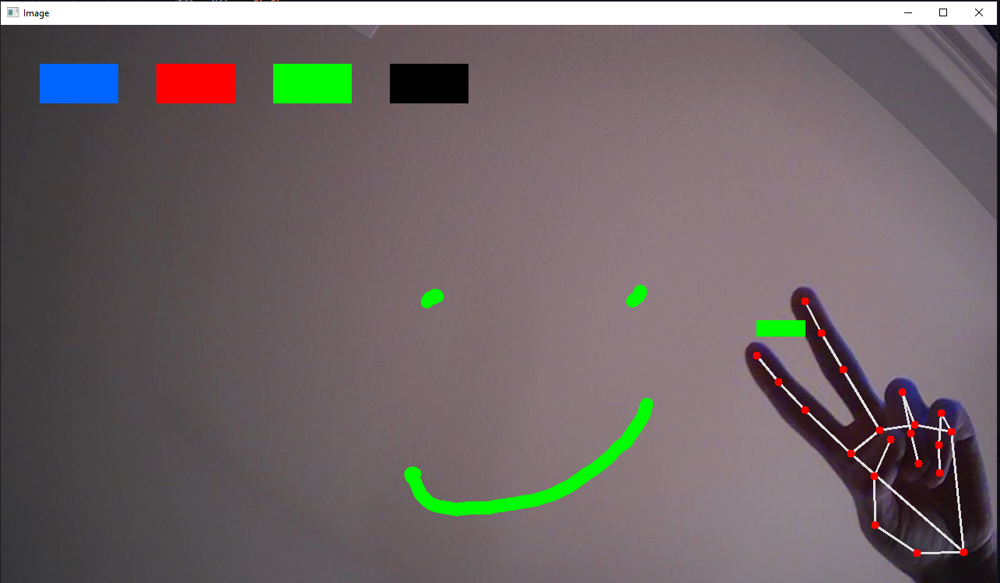

# ComputerVisionPainter

## General Info
This project uses Computer Vision to track a users hand and it allows them to draw in real time using only their fingers. By holding up your index and middle fingers the user enters selection mode, which stops drawing and allows them to choose a new color or the eraser. By holding up your index finger the program will enter drawing mode, which will leave a trail of your selected color wherever your finger designates. There are three colors available; red, green, and blue. There is also an eraser which is seen as the color black. By default the user draws on the screen/camera, but the program also records it to a blank canvas if the user prefers. The blank canvas can be shown by removing the comment in the ComputerVisionPaint file on line 90: `#cv2.imshow("Canvas", imgCanvas)`.

HandTrackingModule.py handles all of the hand detection, it records the position of landmarks along the hand and also determines whether the hand is open or not. 
HandTrackingPaint.py contains all of the logic for the painting, it determines whether the user is in selection or draw mode and displays the drawings.

## Setup
To run the program make sure you have a webcam turned on, its also best to be in a well lit environment. If the program is not detecting your hand try moving different distances from the webcam, and ensure your entire palm is visible. 

## Tech
Project developed with: 
* Python 3
* OpenCV / cv2
* numpy
* MediaPipe

## Demo

## Inspiration
This project is inspired by FreeCodeCamp's Advanced Computer Vision with Python course.
